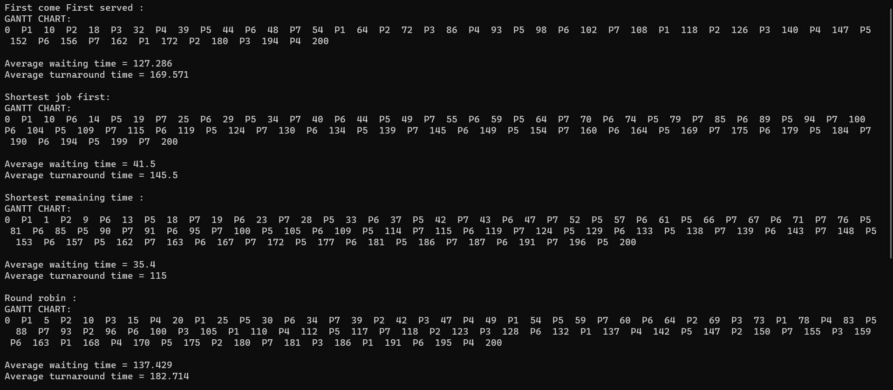
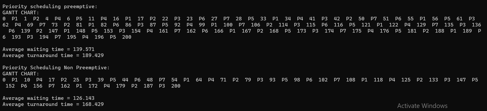

# CPU Scheduling Simulator

This project is a **C++-based simulator** for evaluating various **CPU scheduling algorithms**, which are fundamental in operating system design. It demonstrates how different strategies affect the turnaround and waiting times for processes.

## 📚 Table of Contents

- [Features](#-features)
- [Scheduling Algorithms](#️-scheduling-algorithms)
  - [1. First Come First Served (FCFS)](#1-first-come-first-served-fcfs)
  - [2. Shortest Job First (SJF)](#2-shortest-job-first-sjf)
  - [3. Shortest Remaining Time First (SRTF)](#3-shortest-remaining-time-first-srtf)
  - [4. Round Robin (RR)](#4-round-robin-rr)
  - [5. Priority Scheduling (Preemptive)](#5-priority-scheduling-preemptive)
  - [6. Priority Scheduling (Non-Preemptive)](#6-priority-scheduling-non-preemptive)
  - [7. Non-Preemptive Priority with Aging](#7-non-preemptive-priority-with-aging)
- [Sample Output](#sample-output)
- [Files Included](#-files-included)
- [How to Run](#️-how-to-run)

## 📌 Features

- Simulates multiple CPU scheduling algorithms
- Calculates:
  - Waiting Time
  - Turnaround Time
  - Average metrics for all processes

## ⚙️ Scheduling Algorithms

### 1. First Come First Served (FCFS)
Processes are scheduled in the order of their arrival. It's simple but may cause the "convoy effect" where short tasks wait behind long ones.

### 2. Shortest Job First (SJF)
Selects the process with the shortest burst time. This non-preemptive strategy minimizes average waiting time but may cause starvation of longer processes.

### 3. Shortest Remaining Time First (SRTF)
Preemptive version of SJF. Always executes the process with the least remaining burst time. More efficient but requires frequent context switching.

### 4. Round Robin (RR)
Each process gets a fixed time slot (quantum). After the quantum, the process is moved to the end of the queue. It's fair and responsive but not always optimal for CPU utilization.

### 5. Priority Scheduling (Preemptive)
Processes are assigned priorities. The CPU is allocated to the process with the highest priority. Preemptive nature ensures high-priority tasks interrupt lower ones.

### 6. Priority Scheduling (Non-Preemptive)
Like the preemptive version, but the currently running process can't be interrupted. Prioritizes simplicity over responsiveness.

### 7. Non-Preemptive Priority with Aging
To prevent starvation, this method gradually increases the priority of waiting processes ("aging"). Ensures fairness in long-run scheduling.

##  Sample Output





## 📂 Files Included

- `Task2_OsaidNur_1210733.cpp` — Main simulation source code.
- `Project 2.pdf` — Project description and requirements.
- `res1.jpg`, `res2.png` — Visual results from simulations.

## 🛠️ How to Run

1. Make sure you have a C++ compiler installed (e.g., g++).
2. Compile the code:
   ```bash
   g++ Task2_OsaidNur_1210733.cpp -o cpu_scheduler
   ```
3. Run the executable:
   ```bash
   ./cpu_scheduler
   ```
### ✏️ Customize Process Data

You can **modify the list of processes** in the `main()` function of the source file by changing the contents of the `vector<Process>`.

Each process is defined with the following parameters:

```cpp
{ id, arrivalTime, burstTime, remainingTime, priority, readyQueueArrival }
```

Feel free to input your own data to simulate different CPU scheduling scenarios.


   
